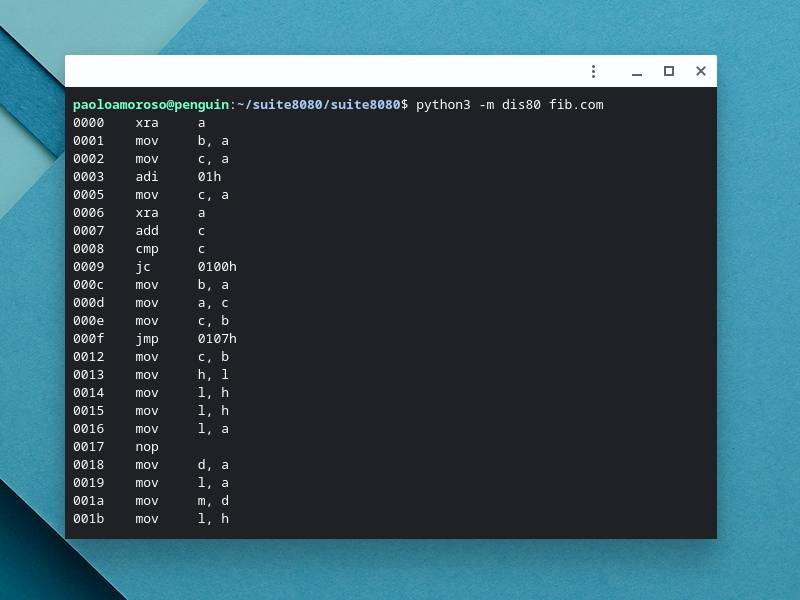

# Suite8080

Suite8080 is a suite of Intel 8080 Assembly cross-development tools written in Python.



The suite comprises the following command-line programs:

* `dis80`: a disassembler
* `asm80`: an assembler
* `ln80`: a linker
* `ar80`: an object library archiver

This hobby programming project is inspired by [a series of blog posts](https://briancallahan.net/blog/20210407.html) by Brian Robert Callahan on demystifying programs that create programs.

The executable files generated and processed by the tools are supposed to run on any Intel 8080 system such as CP/M-80 computers, both actual devices and emulated ones.

Suite8080, which was developed with [Replit](https://replit.com), requires Python 3.6 or later and depends on Pytest for the unit tests.

See the document `design.md` in the source tree for some design notes.


## Installation

Download the source code from the [project's site](https://github.com/pamoroso/suite8080) and expand it into a directory.


## Usage

To run the programs online on Replit visit the [Suite8080 REPL](https://replit.com/@PaoloAmoroso/suite8080) with a browser. You first have to set up the environment by forking the REPL, opening the Shell pane, and editing `~/.bashrc` to add `export PYTHONPATH=.:$PYTHONPATH`. Next, click `Run`.

In a Linux shell on Replit or elsewhere, change to the `suite8080/suite8080` directory in the source tree and execute the following command to set up the environment (not necessary on Replit if you already added this to `/.bashrc`):
```bash
$ export PYTHONPATH=.:$PYTHONPATH
```
Then, to run the disassembler execute:

```bash
$ python3 -m dis80 file.com
```

where `file.com` is an executable Intel 8080 program.

To run the assembler execute:
```bash
$ python3 -m asm80 file.asm
```
where `file.asm` is an Intel 8080 Assembly source file.

The `asm` directory of the source tree contains sample Assembly programs that run on CP/M. You can use the Suite8080 tools to process these programs, for example assemble the sources with `asm80` and disassemble them with `dis80`.


## Status

Suite8080 is in early development. When the main components and features are ready, I'll publish it on PyPI and release distribution archives.


## Author

[Paolo Amoroso](https://www.paoloamoroso.com/) developed Suite8080. Email: `info@paoloamoroso.com`


## License

This code is distributed under the MIT license, see the `LICENSE` file.
